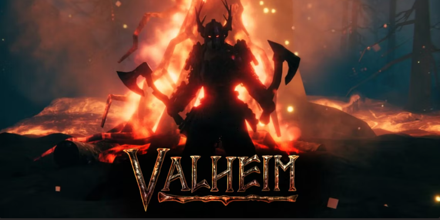

# Valheim de la ranchda

</a>

## Cómo instalar Git en Windows y GitKraken

### Instalar Git en Windows
1. Descarga el instalador de Git para Windows desde el sitio web oficial de Git [Git](https://git-scm.com/book/es/v2/Inicio---Sobre-el-Control-de-Versiones-Instalaci%C3%B3n-de-Git) [[1](https://git-scm.com/downloads)].
2. Ejecuta el instalador descargado y sigue las instrucciones del asistente de instalación.
3. Durante la instalación, elige las opciones predeterminadas a menos que tengas una razón específica para cambiarlas.
4. Una vez finalizada la instalación, verifica si Git se ha instalado correctamente abriendo una ventana de comandos (cmd) y escribiendo `git --version`. Deberías ver la versión de Git instalada.

### Instalar GitKraken
1. Descarga el instalador de GitKraken desde su sitio web oficial [GitKraken](https://www.youtube.com/watch?v=Dg68rWctFaI) [[4](https://www.youtube.com/watch?v=Dg68rWctFaI)].
2. Ejecuta el instalador descargado y sigue las instrucciones del asistente de instalación.
3. Durante la instalación, elige las opciones predeterminadas a menos que tengas una razón específica para cambiarlas.
4. Una vez finalizada la instalación, abre GitKraken y sigue los pasos para configurar tu cuenta y comenzar a usarlo.

## 🌐 Sources
1. [git-scm.com - Instalación de Git](https://git-scm.com/book/es/v2/Inicio---Sobre-el-Control-de-Versiones-Instalaci%C3%B3n-de-Git)
2. [YouTube - Curso Git - GitKraken | Como Descargar e Instalar GitKraken](https://www.youtube.com/watch?v=Dg68rWctFaI)

### Como conectarse al repositorio

1. Ir a la carpetas de mundo, como ejemplo: 
> C:\Program Files (x86)\Steam\userdata\900981045\892970\remote\worlds

ℹ️ _Los números pueden variar ( se puede hacer una busqueda a partir de userdata de un mapa ya existente)_

2. En esta carpeta se encontrarn muchos archivos, los cortaremos y lo llevaremos a una carpeta Backaup

3. Usamos el siguiente comando para enlazar la carpeta con el repositorio

> git remote add origin https://github.com/MaximilianoRodrigoSoria/LibertyCity.git

4. Podemos bajarnos el mundo con el comando:
> git pull origin master

5. En el caso que querramos nuestros otros mundos, debemos de volver a copiar los archivos que cortamos en el paso 2
